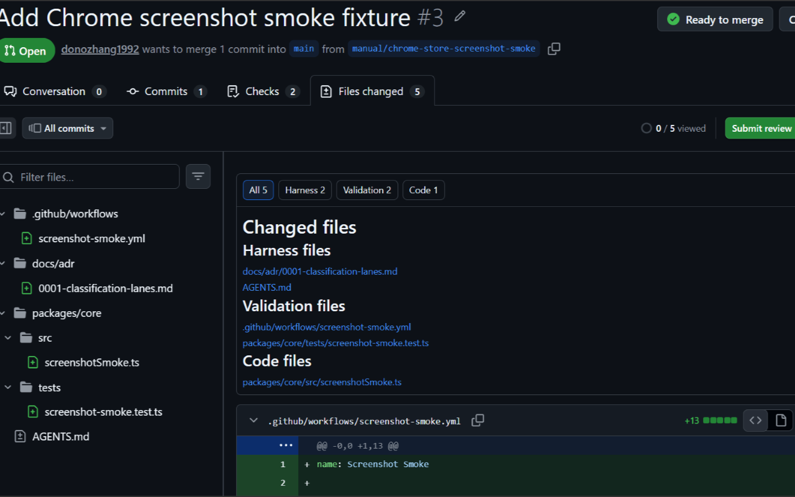
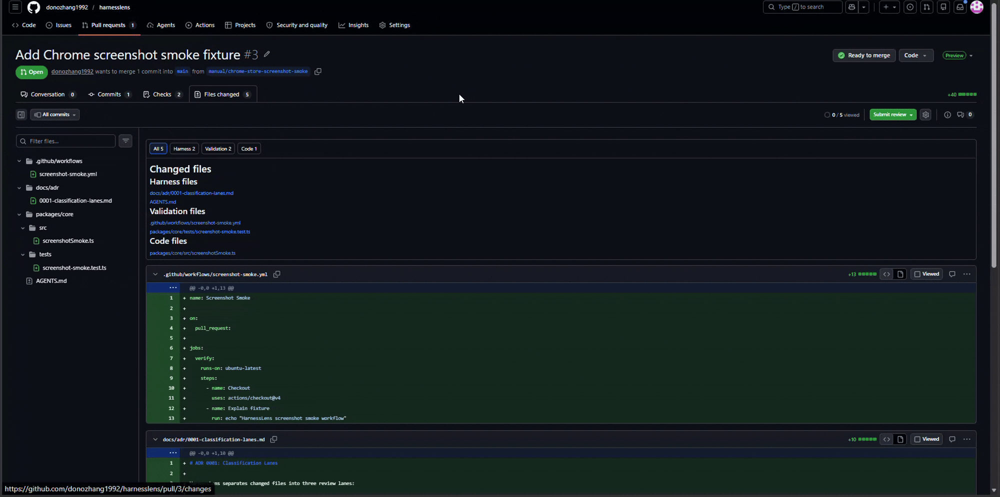
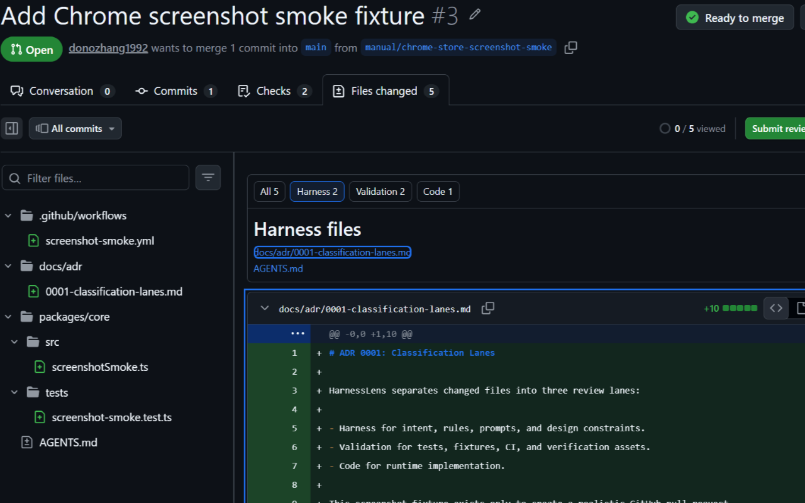
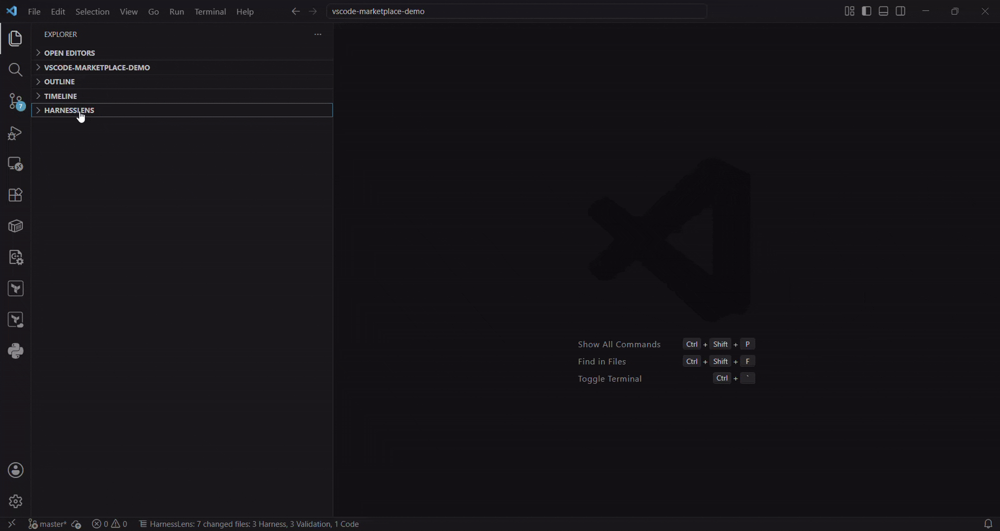

# HarnessLens

HarnessLens is a small review tool for the vibe coding era.

[Install HarnessLens from the Chrome Web Store](https://chromewebstore.google.com/detail/harnesslens/ehakfggplcdihddknemnapfhmiacidjg)
[Install HarnessLens for VS Code](https://marketplace.visualstudio.com/items?itemName=harnesslens.harnesslens-vscode)

Vibe coding pull requests often mix the harness that guides AI-assisted work
with the tests that validate it and the code that ships it. Prompts, specs,
agent instructions, PRDs, ADRs, CI, tests, and runtime source all land in the
same GitHub diff. GitHub shows the diff, but it does not separate those files
by review intent. HarnessLens adds that missing lens.



## Why It Exists

Review time gets wasted when every changed file looks like "just another file."
In vibe coding workflows, the files around the code can matter as much as the
code itself:

- `AGENTS.md`, prompts, PRDs, specs, ADRs, and rules define intent.
- Tests, fixtures, CI, and snapshots prove or protect behavior.
- Runtime source is where implementation changes land.

Those files deserve different review questions. HarnessLens makes the
difference visible before you start reading line-by-line.

## How HarnessLens Helps

HarnessLens classifies changed files into three review lanes:

- **Harness**: product intent, specs, contracts, design notes, agent
  instructions, prompts, ADRs, and project operating rules.
- **Validation**: tests, fixtures, CI workflows, snapshots, and other
  verification assets.
- **Code**: runtime source and files that do not match Harness or Validation
  rules.

The goal is not to replace GitHub, Git, or VS Code. HarnessLens keeps native
diffs and review tools in place, then adds category filters, file counts, and
native diff navigation so reviewers can move through a pull request with more
intent.

## What You Can Do Faster

- Start with Harness files to understand why the change exists.
- Review Validation files separately from runtime implementation.
- Isolate Code files when you only need implementation changes.
- Jump from a category list to GitHub's native diff without losing review
  context.
- Keep using GitHub comments, file folding, viewed state, and review controls.

## Browser Extension

The Browser extension adds an unobtrusive panel to GitHub pull request changed
files. It works with GitHub's native review page rather than replacing it.



### Review All Changed Files By Type

The All tab gives you a compact review map: Harness, Validation, and Code files
with counts and jump links.


### Isolate The Review Lane You Need

Switch to Harness, Validation, or Code to focus the diff list on one kind of
change.



## Current MVP

- **Browser extension**: Harness / Validation / Code filtering and file
  navigation on GitHub pull request changed files.
- **VS Code extension**: a HarnessLens Explorer view for local Git working tree
  and staged changes.
- **Shared Core package**: the classification rules used by both extensions.

HarnessLens deliberately does not install Git hooks, parse commit-message
trailers, infer causality, build relationship graphs, or send repository
contents to a remote service.

## VS Code Extension

The VS Code extension adds a HarnessLens Explorer view for local Git changes,
including staged and unstaged files.



## Requirements

- Node.js 20 or newer.
- npm 10 or newer.
- Git.
- Chrome or Edge for Browser extension testing.
- VS Code 1.100 or newer for VS Code extension testing.

## Install Dependencies

```powershell
npm install
```

## Build And Verify

```powershell
npm test
npm run typecheck
npm run build
```

Expected result:

- Core, Browser, and VS Code tests pass.
- TypeScript checks pass.
- Browser artifacts are written to `extensions/browser/dist`.
- VS Code artifacts are written to `extensions/vscode/dist`.
- Build verification prints `Build artifacts verified.`

## Browser Extension: Install

Install the published Browser extension from the Chrome Web Store:

https://chromewebstore.google.com/detail/harnesslens/ehakfggplcdihddknemnapfhmiacidjg

For local development testing:

```powershell
npm run build:browser
```

Then in Chrome:

1. Open `chrome://extensions`.
2. Enable **Developer mode**.
3. Select **Load unpacked**.
4. Choose `extensions/browser/dist`.

Open a GitHub pull request and go to **Files changed**. HarnessLens appears
above the native GitHub diff list with All / Harness / Validation / Code tabs.

## Browser Extension: Usage

On a GitHub pull request:

1. Open **Files changed**.
2. Use **All** to see every changed file grouped by category.
3. Use **Harness**, **Validation**, or **Code** to isolate one category.
4. Click a listed file path to jump to the native GitHub diff.
5. Continue using native GitHub comments, review controls, and file folding.

HarnessLens may briefly wait for GitHub's progressive diff list to finish
rendering. If GitHub changes its DOM, HarnessLens should degrade to a readable
state rather than hiding GitHub's native UI.

## VS Code Extension: Install

Install the published VS Code extension from the Marketplace:

https://marketplace.visualstudio.com/items?itemName=harnesslens.harnesslens-vscode

For local development testing:


1. Open this repository in VS Code.
2. Run `npm run build`.
3. Open **Run and Debug**.
4. Start the **HarnessLens Extension** launch configuration.
5. In the Extension Development Host, open a Git repository with local changes.

HarnessLens appears in Explorer. Selecting a file opens the native Git diff.
Right-click a file for **Open Diff** or **Open File**.

## VS Code Extension: Usage

In a Git repository with local changes:

1. Open Explorer.
2. Expand **HarnessLens**.
3. Review the **Harness**, **Validation**, and **Code** groups.
4. Select a file to open the native Git diff.
5. Right-click a file for **Open Diff** or **Open File**.
6. Use **HarnessLens: Refresh Changed Files** if you want an immediate manual
   refresh.

HarnessLens listens to VS Code Git repository lifecycle and Git state events so
the tree updates when repositories open, close, or change.

## Default Classification Rules

HarnessLens currently uses built-in shared defaults.

Current examples classified as **Harness**:

- `AGENT.md`, `AGENTS.md`
- `PRD.md`, `SPEC.md`, `CONTRACT.md`, `DESIGN.md`
- `RULES.md`, `TASKS.md`, `TEST_PLAN.md`
- `.codex/**`
- `.cursor/rules/**`
- `.github/copilot-instructions.md`
- `docs/adr/**`
- `docs/spec/**`
- `prompts/**`
- `harness/**`

Files outside these built-in Harness patterns are not treated as Harness by
name alone. For example, `PLAN.md` currently falls back to **Code** unless it is
inside a Harness directory such as `harness/**` or another supported Harness
path.

Current examples classified as **Validation**:

- `.github/workflows/**`
- `tests/**`
- `__tests__/**`
- `fixtures/**`
- `test-fixtures/**`
- `snapshots/**`
- `__snapshots__/**`
- `*.test.ts`, `*.test.tsx`, `*.spec.ts`, `*.spec.tsx`
- `*.snap`

Everything else defaults to **Code**.

## Configuration

User-configurable classification is planned but not implemented in `0.1.0`.
This is the next major product focus. Different vibe coding teams use different
planning files, prompt directories, agent rules, and validation layouts, so
HarnessLens should let each repository define its own Harness / Validation /
Code rules without changing extension code.

The intended design is a repo-level config file such as `.harnesslens.yml`
that overlays the built-in defaults:

```yaml
harness:
  include:
    - "docs/decision-records/**"
    - "ai/prompts/**"
  exclude:
    - "docs/spec/generated/**"

validation:
  include:
    - "quality/**"

code:
  include:
    - "tools/runtime/**"
```

Planned semantics:

- Built-in defaults run first.
- Project config can add include and exclude patterns.
- Browser and VS Code consume the same shared Core config behavior.
- Config errors should be shown as readable diagnostics, not silent
  misclassification.

Until config support lands, update the shared Core classifier and tests when
changing defaults.

## Package Local Artifacts

Browser zip:

```powershell
npm run package:browser
```

This writes `dist/harnesslens-browser-0.1.0.zip`.

VS Code VSIX:

```powershell
npm run package:vscode
```

This command uses `@vscode/vsce` through `npx` and writes
`dist/harnesslens-vscode-0.1.0.vsix`. It may download `@vscode/vsce` if it is
not already available.

Package both:

```powershell
npm run package
```

Release readiness check:

```powershell
npm run release:check
```

## Manual Test Checklist

Use [PRE_RELEASE_MANUAL.md](PRE_RELEASE_MANUAL.md) before publishing. It covers
Browser and VS Code local installation, category checks, navigation, refresh,
and regression cases.

Use [RELEASE_CHECKLIST.md](RELEASE_CHECKLIST.md) for packaging and release
approval.

## Privacy

See [PRIVACY.md](PRIVACY.md). HarnessLens does not collect telemetry and does
not send repository contents to a remote service.

## Contributing

See [CONTRIBUTING.md](CONTRIBUTING.md) for local setup, test expectations, and
the current MVP boundaries. See [SECURITY.md](SECURITY.md) for vulnerability
reporting.

## License

HarnessLens is released under the [MIT License](LICENSE.md).

## Release Notes

See [CHANGELOG.md](CHANGELOG.md).

## Development Plan

Near-term before public release:

- Produce `0.1.0` Browser zip and VS Code VSIX artifacts.
- Complete manual Browser and VS Code smoke tests.
- Add screenshots or short demo media for the repository and extension pages.
- Decide whether Browser release starts as GitHub Release only or Chrome Web
  Store submission.

Planned after `0.1.0`:

- Shared configurable classification rules.
- Browser diagnostics for unsupported GitHub DOM layouts.
- Optional richer VS Code commands such as copy relative path.
- Packaged marketplace release flow for VS Code.
- Browser store release flow and store listing assets.

Out of scope for this MVP:

- Git hooks.
- Commit trailer protocols.
- Causality inference.
- Relationship graphs.
