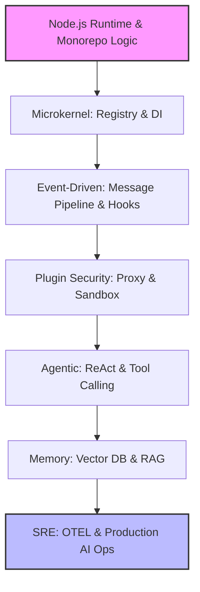

# OpenClaw 资深 AI 架构师进化路线图 (DevOps 转型版)

## 1. 核心战略：架构同构映射 (Architecture Isomorphism)
针对你的 4 年 DevOps 背景，我们将采用“心智模型平移”策略。不将代码视为孤立的逻辑，而将其视为“微型基础设施”：
- **消息管线 (Message Pipeline) = CI/CD 流水线**：消息的流转即是 Job 的执行。
- **插件系统 (Plugin SDK) = K8s Operator/Sidecar**：通过定义标准接口实现能力的声明式扩展。
- **依赖注入 (DI/IoC) = 声明式配置 (IaC)**：将系统组件的关联从硬编码转变为可插拔的配置。
- **可观测性 (Tracing) = SRE 全链路追踪**：将 APM 思路引入 Agent 思考链路。

## 2. 学习路径依赖图 (Sequence Graph)

## 3. 深度逆向学习计划表

| 知识模块 | 学习策略与结合点 (DevOps Mapping) | 学习方法 (通过逆向 OpenClaw) | 预计投入 |
| :--- | :--- | :--- | :--- |
| **工程基建 (Monorepo)** | **映射：集群多租户。** 理解 pnpm workspace 如何在单一仓库中隔离并共享几十个 packages。 | 分析根目录 `pnpm-workspace.yaml`。研究 `tsconfig.json` 的层级继承。尝试给 `packages/` 下新增一个空模块并跑通构建。 | 1 周 |
| **微内核架构 (IoC/DI)** | **映射：K8s Control Plane。** 核心不处理业务，只负责 Registry 和调度。 | 重点分析 `src/plugins`。追踪一个插件（如 `brave`）是如何通过 `Registry.register()` 被核心识别并挂载的。 | 2 周 |
| **异步流与管道 (Pipeline)** | **映射：Jenkins Pipeline / GitHub Actions。** 消息通过一系列 Middleware 处理。 | 逆向 `Dispatcher` (`src/auto-reply/dispatch.ts`)。理解 `Async Streams` 如何处理 LLM 的打字机输出。尝试在管道中插入一个自定义 Log Filter。 | 2 周 |
| **安全沙箱 (Plugin Proxy)** | **映射：RBAC / Network Policy。** 插件是不可信的，必须通过 Proxy 层进行权限截断。 | 深入 `src/plugins/loader.ts`。阅读源码，看它如何使用 JS `Proxy` 封装对象，防止插件访问核心或非授权数据。 | 2 周 |
| **Agent 调度逻辑** | **映射：自动化脚本调度。** Agent 是基于 Prompt 的动态脚本执行器。 | 拆解 `AgentRunner` (`src/auto-reply/reply/agent-runner.ts`)。分析系统如何将 User Message 转换为 `Tool Calling` 请求。手动模拟一次工具返回。 | 3 周 |
| **RAG 与向量存储** | **映射：分布式存储 / Cache。** 向量数据库是 AI 的外挂知识磁盘。 | 分析 `extensions/memory-lancedb`。观察数据如何从 Markdown 变为 Embedding 并存入 LanceDB。 | 2 周 |
| **AI 可观测性 (OTEL)** | **映射：Prometheus / Jaeger。** AI 的思考过程是黑盒，必须通过 Trace 暴露内部状态。 | 查找项目中的扩展与诊断工具 (`extensions/diagnostics-otel`)。分析一条消息在各个插件和模型之间的流转溯源。 | 2 周 |
| **生产加固 (AI Ops)** | **映射：WAF & Rate Limiting。** 防止恶意 Prompt Injection 导致系统资源枯竭。 | 逆向 `src/security` 目录。研究 SSRF 防护逻辑。尝试编写一个针对特定有害 Prompt 的拦截规则。 | 2 周 |