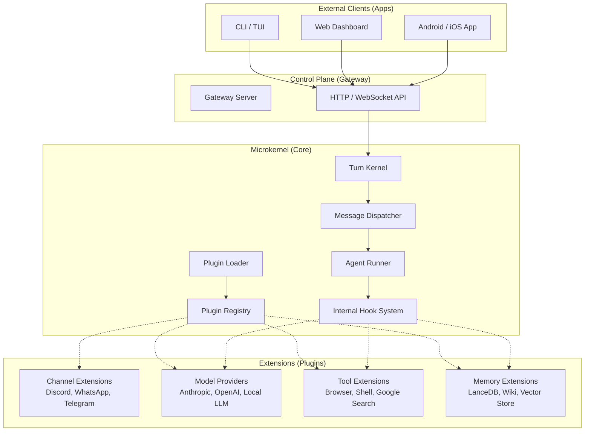
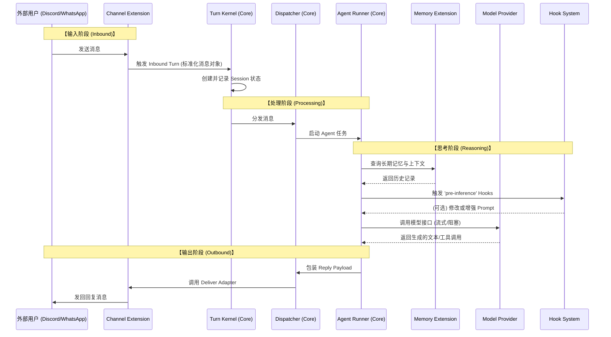

# OpenClaw 宏观架构与数据流向图

本文件详细描述了 OpenClaw 的系统架构以及消息在各组件间的流转逻辑。

## 1. 宏观架构图 (Macro Architecture)

OpenClaw 采用 **微内核 (Microkernel)** 架构。核心（Core）负责流程编排和生命周期管理，而具体的功能（通道、模型、工具、存储）全部通过插件（Extensions）实现。

### 组件说明：
- **Apps**: 用户交互入口。
- **Gateway Server**: 系统的门面，处理 API 请求并将其转发给内核。
- **Turn Kernel**: “回合内核”，管理每一次对话“回合”的生命周期（开始、记录、结束）。
- **Plugin Registry**: 系统的账本，记录所有已加载插件的能力。
- **Agent Runner**: 负责召集大模型、装载上下文、调用工具的逻辑执行引擎。
- **Internal Hook System**: 允许插件介入对话流程的各个阶段（如：在发送给模型前修改 Prompt）。

---

## 2. 数据流向图 (Data Flow)

这张图展示了一个典型的“接收消息 -> 思考 -> 发出回复”的全链路流程。

### 关键数据流转点：
1.  **标准化 (Normalization)**: `Channel Extension` 将各个平台私有的 API 格式转换为 OpenClaw 统一的 `TurnContext`。
2.  **上下文装配 (Context Assembly)**: `Agent Runner` 会动态从 `Memory` 插件中提取关联信息，并合并当前消息。
3.  **插件干预 (Hooking)**: 在请求模型前后，`Hook System` 允许其他插件（如：内容审查、自动翻译）无缝介入。
4.  **适配输出 (Delivery)**: 最终回复由 `Channel Extension` 再次转换回平台特定的 API 调用（如：`bot.sendMessage`）。
